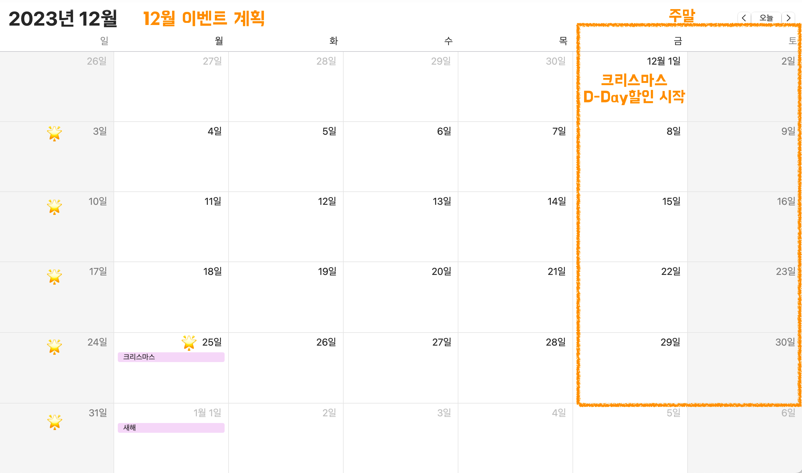

# 프로젝트명 :  크리스마스 프로모션🎉

---

# 프로젝트 설명

- 사용자로부터 방문 날짜와 주문할 메뉴와 개수를 입력받는다.
- 총 주문 금액을 보여준다
- 증정 메뉴를 보여준다.
- 혜택 내역을 보여준다.
- 총 혜택 금액을 보여준다
- 할인 후 예상 결제 금액을 보여준다.
- 어떤 이벤트 배지를 받게되는지 보여준다.

## 구현 기능 목록

### 사용자가 예상 방문 날짜를 입력한다.

#### 예외처리

- [x] 입력이 숫자가 아니라면 예외 발생
- [x] 입력이 Int 형의 최대값을 넘길경우 예외 발생
- [x] 입력이 1 ~ 31 사이 값이 아니라면 예외 발생

#### 기능

- [x] 디데이 할인이 얼마나 적용되는지 구한다.
    - [x] 1 ~ 25 일 사이인지 확인한다.
    - [x] 얼마의 할인을 받게되는지 계산한다.
- [x] 특별 할인이 얼마나 적용되는지 확인한다.
    - [x] 별이 붙은 날짜라면 1000원 할인

### 사용자가 주문할 메뉴와 개수를 입력한다.

#### 예외처리

- [ ] , (comma)를 기준으로 나눠지지 않는다면 예외 발생
- [ ] , (comma)로 나눠진 값이 '-' 표시로 나눠지지 않는다면 예외 발생
- [ ] ' - ' 표시로 나눠진 값이 (음식-개수) 형태를 갖지 않는다면 예외 발생
    - [ ] 개수가 개수가 숫자가 아니라면 예외 발생
    - [ ] 개수가 Int 형의 최대값을 넘길경우 예외 발생
- [ ] (음식-개수)에서 음식이 메뉴에 포함되어있지 않다면 예외 발생
- [ ] (음식-개수)에서 메뉴가 중복되었다면 예외 발생
- [ ] (음식-개수)에서 개수가 1 ~ 20 사이의 값이 아니라면 예외 발생
- [ ] 음료만 주문시 예외발생
- [ ] 주문 총 개수가 20을 넘는다면 예외발생

#### 기능

- [ ] 평일, 주말 할인이 얼마나 적용되는지 구한다.
    - [ ] 평일은 디저트당 2023원 할인
    - [ ] 주말은 메인 메뉴당 2023원 할인
- [ ] 증정 이벤트가 얼마나 적용되는지 구한다.
    - [ ] 총 주문 금액이 12만원 넘었는지 확인한다.
- [ ] 어떤 배지가 적용되는지 확인한다.
    - [ ] 총 혜택 금액에 따라서 적용한다.
    - 5천 원 이상: 별
    - 1만 원 이상: 트리
    - 2만 원 이상: 산타

---

## 협력 관계

---

## 리팩토링 할 내용

- [ ] 내가 정의한 Exception 구현
- [ ] 클래스명, 메서드명, 변수명 네이밍 다시한번 확인
- [ ] 상수처리 enum으로 가능한지 고민해보기 + enum과 public static final 어떤것을 사용할지 다시 고민해보기
- [ ] 이벤트에 인터페이스 적용시켜보기

```
<애피타이저>
양송이수프(6,000), 타파스(5,500), 시저샐러드(8,000)

<메인>
티본스테이크(55,000), 바비큐립(54,000), 해산물파스타(35,000), 크리스마스파스타(25,000)

<디저트>
초코케이크(15,000), 아이스크림(5,000)

<음료>
제로콜라(3,000), 레드와인(60,000), 샴페인(25,000)
```



12월 이벤트 계획

날짜 입력 후------------------------------
크리스마스 디데이 할인
이벤트 기간: 2023.12.1 ~ 2023.12.25
1,000원으로 시작하여 크리스마스가 다가올수록 날마다 할인 금액이 100원씩 증가
총주문 금액에서 해당 금액만큼 할인
(e.g. 시작일인 12월 1일에 1,000원, 2일에 1,100원, ..., 25일엔 3,400원 할인)

특별 할인: 이벤트 달력에 별이 있으면 총주문 금액에서 1,000원 할인

메뉴와 개수 입력 후---------------------------
평일 할인(일요일~목요일): 평일에는 디저트 메뉴를 메뉴 1개당 2,023원 할인
주말 할인(금요일, 토요일): 주말에는 메인 메뉴를 메뉴 1개당 2,023원 할인

증정 이벤트: 할인 전 총주문 금액이 12만 원 이상일 때, 샴페인 1개 증정

이벤트 기간: '크리스마스 디데이 할인'을 제외한 다른 이벤트는 2023.12.1 ~ 2023.12.31 동안 적용

혜택 금액에 따른 12월 이벤트 배지 부여
총혜택 금액에 따라 다른 이벤트 배지를 부여합니다. 이 배지는 2024 새해 이벤트에서 활용할 예정입니다. 배지에 따라 새해 이벤트 참여 시, 각각 다른 새해 선물을 증정할 예정입니다.
5천 원 이상: 별
1만 원 이상: 트리
2만 원 이상: 산타

고객에게 안내할 이벤트 주의 사항
총주문 금액 10,000원 이상부터 이벤트가 적용됩니다.
음료만 주문 시, 주문할 수 없습니다.
메뉴는 한 번에 최대 20개까지만 주문할 수 있습니다.
(e.g. 시저샐러드-1, 티본스테이크-1, 크리스마스파스타-1, 제로콜라-3, 아이스크림-1의 총개수는 7개)